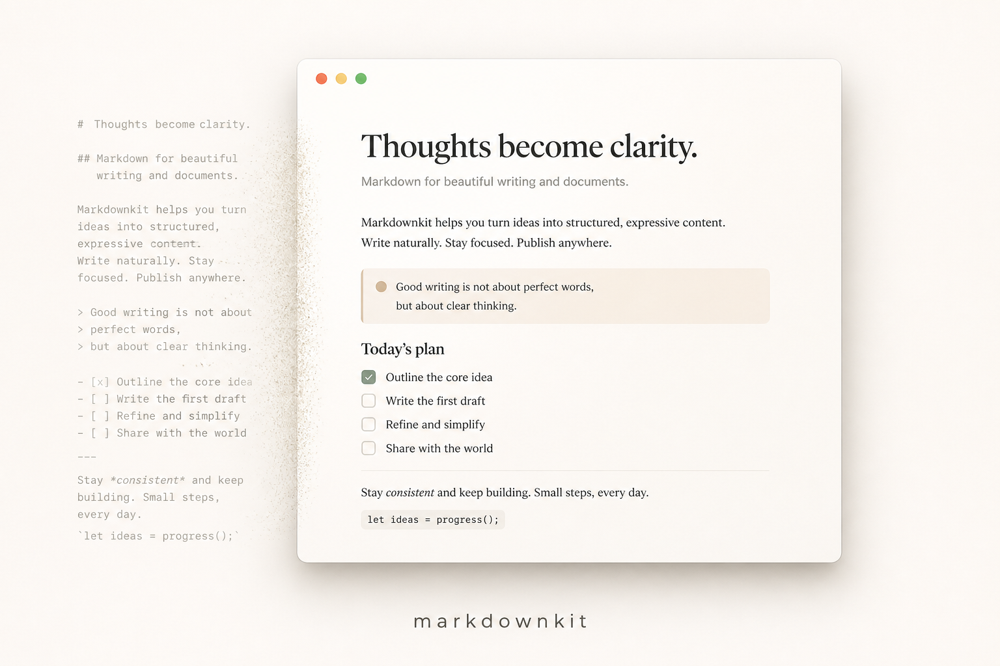

# MarkdownKit

A beautiful, simple markdown viewer for local files on macOS. It is built to stay out of the way: Notion-like typography, native parsing, and essentially no CPU while a document is just sitting there.

MarkdownKit is a **viewer**. Open a `.md` file, read it, click a link, go back to work.

## What it does

- Opens local markdown (`.md`, `.markdown`, `.mdown`, `.mkd`)
- Renders GFM basics: headings, lists, task lists, tables, strike, footnotes, fenced code
- Renders mermaid fences as diagrams (the library loads only when a note has one)
- Resolves relative images and in-app links to other markdown files
- Reloads when the open file changes on disk (optional, in Settings)
- Appearance, front matter, and live reload in **MarkdownKit → Settings…**
- Back / forward when following local markdown links
- **File → Open in Finder** and **Copy File Path**
- Registers as a macOS viewer so Finder can double-click `.md` files into the app
- Uses no web fonts, no JS markdown parser, and no animation loop

Parsing happens in Rust (`pulldown-cmark`). The UI is a small static HTML/CSS/JS shell. There is no React, no bundler, and no background polling.

## Install

**macOS 11+.** Pick one.

### Download a release

1. Get the latest `.dmg` from [Releases](https://github.com/TyrellD1/markdownkit/releases/latest).
2. Open it and drag **MarkdownKit** into `/Applications`.
3. Clear Gatekeeper’s quarantine (the build is not Apple-notarized; otherwise macOS may say the app is damaged):

```sh
xattr -cr /Applications/MarkdownKit.app
open -a MarkdownKit
```

Current builds are Apple Silicon (`aarch64`).

### Build from source

Needs [Node.js](https://nodejs.org/) 20+ and [Rust](https://rustup.rs/) (stable).

```sh
git clone https://github.com/TyrellD1/markdownkit.git
cd markdownkit
./scripts/install.sh
```

That compiles a release `.app` and copies it to `/Applications`. Same command: `npm run install-app`.

## Develop

```sh
git clone https://github.com/TyrellD1/markdownkit.git
cd markdownkit
npm install
npm test
npm run dev
```

Then **File → Open** (`⌘O`) and choose `examples/welcome.md` or `examples/kitchen-sink.md`. You can also drop a markdown file onto the window.

To produce a `.app` without installing it: `npm run build`. The bundle lands at `src-tauri/target/release/bundle/macos/MarkdownKit.app`.

## Open `.md` files from Finder

1. Install the built app (see above).
2. Select any `.md` file in Finder.
3. **File → Get Info**.
4. Under **Open with**, choose **MarkdownKit**.
5. Click **Change All…** if you want double-click to always use MarkdownKit.

Until that default is set, you can still **Open With → MarkdownKit**.

## How anyone can test

| Check | How |
| --- | --- |
| Unit tests | `npm test` (or `cargo test --manifest-path src-tauri/Cargo.toml`) |
| Visual layout | `npm run dev`, open `examples/welcome.md` or `examples/kitchen-sink.md` |
| Relative links | Click “the linked note”, then **Back** |
| Relative images | Confirm the `markdownkit` SVG at the bottom of welcome |
| Live reload | Leave Settings on, then edit the open file |
| External links | Click `https://` links; they open in the default browser |
| Finder | Build the app, then Open With / double-click a `.md` file |

There is a longer checklist in [DEV_TESTING.md](DEV_TESTING.md).

## Project layout

```
ui/                 static viewer (no bundler)
src-tauri/          Tauri + markdown engine
examples/           sample notes for manual tests
docs/               README artwork and source icon
```

## License

Use it. The repo is at [github.com/TyrellD1/markdownkit](https://github.com/TyrellD1/markdownkit).
