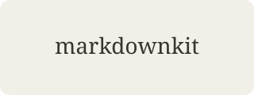

# Kitchen sink

> **Live reload** — this line was just added. If you can read it, the file on disk synced into the viewer.

Every markdown shape MarkdownKit currently renders. Open this from **File → Open**, then follow [the linked note](./linked.md#more) and use **Back**.

## Headings

### Heading 3
#### Heading 4
##### Heading 5
###### Heading 6 {#custom-id}

## Emphasis

Regular paragraph with *italic*, **bold**, ***both***, ~~strike~~, `inline code`, and a [web link](https://example.com).

Line one with a hard break.  
Line two.

## Lists

- Unordered one
- Unordered two
  - Nested
  - Nested again
1. Ordered one
2. Ordered two
   1. Nested ordered

## Tasks

- [x] Render checkboxes
- [ ] Leave the unchecked ones empty
- [x] Keep them read-only

## Table

| Align left | Center | Right |
| --- | :---: | ---: |
| tea | 2 | 12 |
| bread | 1 | 4 |

## Quote and rule

> A callout-looking blockquote.
>
> Nested thought.

---

## Code

```rust
fn main() {
    println!("kitchen sink");
}
```

```
plain fence
```

## Image



## Footnote

A claim with a note.[^note]

[^note]: Footnotes collect at the bottom.

## Auto link

<https://example.com/path>

See also [welcome](./welcome.md) if you want to walk the history stack.
